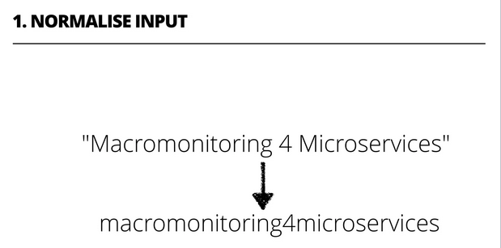
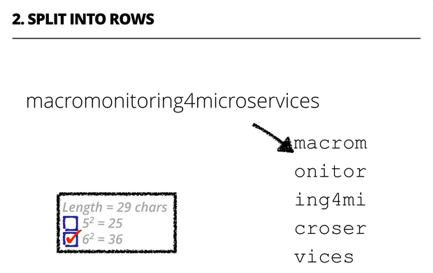
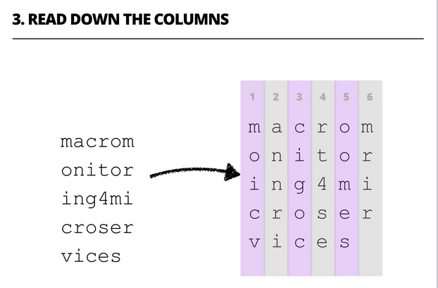
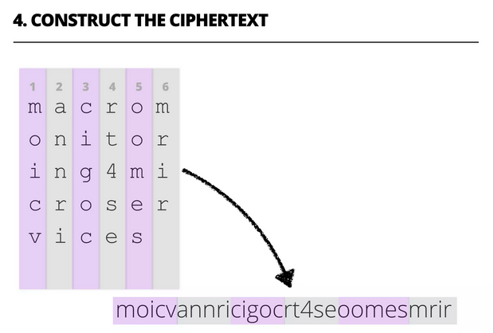

# CryptoSquare

This is an Elixir implementation of a simple encoding algorithm called Crypto Square.

Just to make the implementation more "interesting" (i.e., needlessly complicated), I've split the parts of the algorithm across multiple Elixir processes :-)

## Running the tests

`mix test`

## Running the code (with canned input)

`iex -S mix`

Note: this command executes the code in `runner.ex`

## How Crypto Square works

Source: slides from [my YOW West 2015 presentation](https://www.slideshare.net/andee_marks/yow-west-2015-macromonitoring-for-microservices)

_All non alphanumberic characters are removed from the plain text._

_The size of the "square" (normally a rectangle) is calculated based on the length of the normalised plaintext._

_The normalised plaintext is arranged into a rectangular grid._

_The ciphertext is formed by "reading" down each of the columns and joining the resultant columns together._
